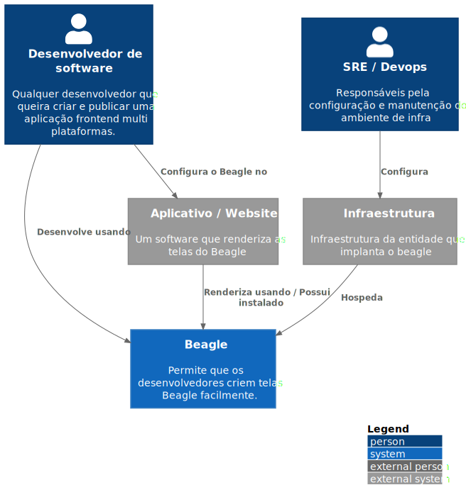

# C1 -  Context

**Nível 1: Diagrama de contexto do sistema**

Esse nível mostra de forma macro a aplicação, os atores, seus papéis e também como eles interagem entre si. O principal objetivo aqui é representar o produto em sua forma mais abstrata.

***Contexto Beagle***

O Beagle é um framework open source que ajuda desenvolvedores a implementar aplicações Server-Driven de uma maneira cross-platform:

* Desenvolvedores podem facilmente criar e prototipar telas frontend usando a biblioteca Beagle Backend e seus utilitários para layout (posicionamento e aparência) e comportamento (ações).
* Uma vez criadas, essas telas podem ser enviadas para aplicações frontend mobile ou web, elas usam a biblioteca do Beagle Frontend para renderizar os layouts.

