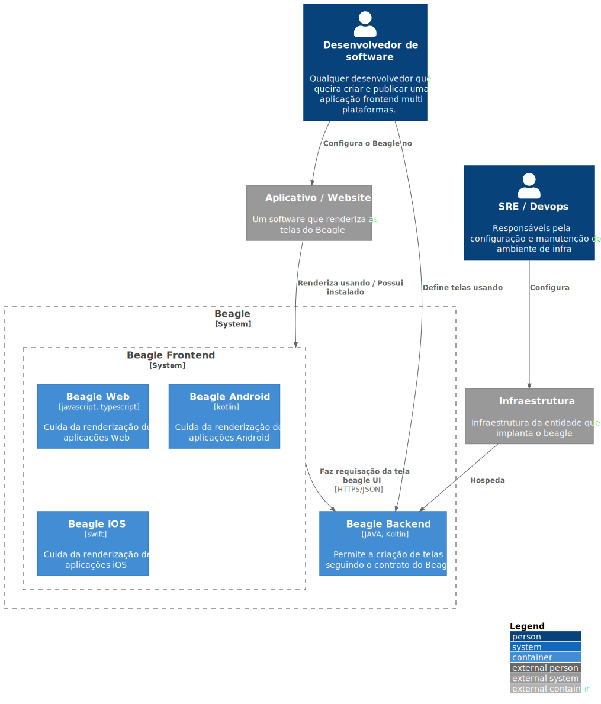

# C2 - Container

`\C2 - Container`

* [C4Model](/docs/README.md)
  * [C1 -  Context](/docs/C1%20-%20%20Context/README.md)
  * [**C2 - Container**](/docs/C2%20-%20Container/README.md)
  * [C3 -  Component](/docs/C3%20-%20%20Component/README.md)
    * [Module 1](/docs/C3%20-%20%20Component/Module%201/README.md)

---

[C4Model (up)](/docs/README.md)

---

**Nível 2: Diagrama de containers do sistema**

Nesse nível mostramos de maneira mais detalhada o sistema descrevendo os seus containers (Não confundir com o Docker) e como eles se comunicam/interagem. Nesse nível é dado ênfase na arquitetura e tecnologias utilizadas. A ideia é mostrar como o sistema é de forma macro. Um container pode ser uma aplicação web, um database, um sistema de arquivos, etc.

***Containers Beagle***

No segundo nível de detalhamento temos os **containers** de `backend` e `frontend`:

* O Beagle Frontend é instalado em aplicações Web e Mobile, que renderizam nativamente as telas recebidas do beagle backend.
* O Beagle Backend é configurado no backend de uma aplicação para facilitar a criação de componentes server driven.

